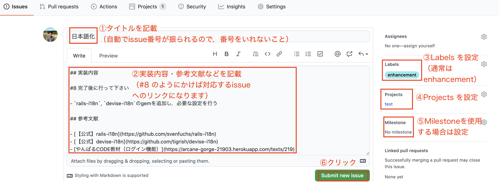

## （チーム開発）やんばるCODE教材クローンアプリ制作

### クローン元の URL

https://arcane-gorge-21903.herokuapp.com/

### 開発環境

- Ruby 2.7.2
- Rails 6.0.3.4
- PostgreSQL

### 開発環境構築(Ruby)

- Ruby 2.7.2 をインストールされていない場合は，以下を実行して下さい。
  - 「インストール済みのRuby」と「使用中のバージョン」は `rbenv versions` で確認できます
  - Ruby のバージョンごとに gem をインストールする必要があります

```
cd
brew update
brew upgrade rbenv ruby-build
rbenv install 2.7.2
rbenv global 2.7.2
gem install rails
```

VSCodeの教材で環境構築を行い，拡張機能を利用されている場合は以下も実行してください。

```
gem install solargraph
gem install htmlbeautifier
gem install rufo
```

【補足】もしRubyのデフォルトバージョンを変更したくない方は，gemのインストール後に `rbenv global 指定したいバージョン` を実行して下さい。

### 開発環境構築(Railsアプリ)

```
git clone URL名
cd リポジトリ名
bundle install
yarn install --check-files
rails db:create db:migrate
```

### ブランチモデル

ブランチ名 | 目的 | 備考
--- | --- | ---
main | リリース用 | masterではない！
develop | 開発用 | 機能実装用のブランチはここから切ること！
feature/*** | 機能実装用 | 派生元はdevelopブランチとすること！

- 新規タスクに取りかかる際は，必ず `develop` ブランチから切って下さい。`main` ブランチや `master` ブランチから切らないようにして下さい
- 機能実装用のブランチは， `feature/***` の形式（`feature/` を付ける）として下さい
- `main` ブランチの運用方針はメンバー内で決めて下さい

### タスク管理

`GitHub` の `issue` で行うこととします。

以下を参考に必要な `issue` を作成していただきます。

1. Projects を作成

`Projects` を作成することで，`issue（タスク）`を「カンバン」方式で管理できるようになります。

- GitHubリポジトリの `Projects` タブをクリック
- 「Create a project」ボタンをクリック
- 「Project board name」は「Description」は自由に設定。「Project template」は `Automated kanban with reviews` に設定し，「Create project」ボタンをクリック
- 「To do」に入っているデフォルトタスクは全てアーカイブする
  - 「To do」の左側の「…」をクリックし，「Archive all cards」をクリックし，「Archive all cards」ボタンをクリック

2. Milestones を設定（初期は省略してもよい）

`Milestones` で「期限」を設定し，`issue` を登録することで，タスクの進み具合を管理することができます。

- GitHubリポジトリの `Issues` タブをクリック
- 「Milestones」タブをクリック
- 「New milestone」ボタンをクリック
- 「Title」「Due date」「Description」を適切に設定し，「Create milestone」ボタンをクリック

3. issues を設定

- GitHubリポジトリの `Issues` タブをクリック
- 「New issue」ボタンをクリック
- 「Title」と「comment」を記載（初期タスクは `issues.md` を参考にして下さい）
- 右側の「Labels」は原則 `enhancement`，「Projects」 は 上記 で作成したものを選択
- （作成済みならば「Milestone」を設定）
- 「Submit new issue」ボタンをクリック



なお，issue の「Assignees」はある程度一気に決めてしまう（タスクを誰が行うかを決める）のが普通ですが，タスクの難易度・実装にかかる時間がよく分からない最初の段階で一気に決めてしまうと，ほぼ予定通りにはなりません。

しばらくは，タスクに取り掛かるタイミングで「Assignees」を選択する方式でよいでしょう。

### チーム開発の進め方（開始時）

本来はメンバー内で協議し，DB設計，必要なタスクの洗い出し，タスクの切り分けを行うべきなのですが，チーム開発の進め方さえ十分に把握できていない最初の段階ではなかなか難しいと思います。

そこで `issue` に登録すべきタスクを途中まで `issues.md` に記載しております。

最初はこちらを参考に `issue` を設定し，実装を開始していただく形式でよいかと思います。

`issue` の設定作業はチームメンバーで話し合い，割り振りを決めて下さい。

チームメンバーが同じ日時に集まることが可能であれば，Zoom などで話し合うのもよいでしょう。

初期設定のタスクが完了しましたら，メンバー内で「どこまで実装するか」「どのような issue を設定するか」などを協議していただき，続きを進めていただきます。

### チーム開発の進め方（issue設定後）

初期の issue 設定が完了しましたら，各自以下のサイクルで進めて下さい。

1. GitHubの `Projects` タブから「カンバン」に移動し，「To do」に入っている issue の中から1つを選択

- 順番通りでなくても構いません。ある程度依存関係がありますので，必要に応じて順番を飛ばして下さい

2. 選択した issue の「Assignees」で自分を選択

- この作業により，誰が issue を担当しているかが分かるようになります

3. 選択した issue を「In progress」に移動

- この作業により，複数人が同じタスクを実行することを避けることができます

4. develop ブランチからブランチを切る

- ブランチ名は，「issueのタスク名」を2〜4単語の英語で表したものとすること

- 前回の作業ブランチからそのまま新しいブランチを切らないようにして下さい

```
git switch -c feature/ブランチ名
```

（`git switch -c feature/ブランチ名` と `git checkout -b ブランチ名` は同じコマンドです）

5. 実装中は add, commit をこまめに行う

- 【参考記事】https://qiita.com/jnchito/items/40e0c7d32fde352607be
- コミットメッセージは，変更内容を誰が見ても分かるように簡潔に書くこと

6. 動作確認を行った上で，GitHubにプッシュ

```
git push origin HEAD
```

7. GitHubでプルリクを出す

- プルリクの「タイトル」は「issueのタスク名」に合わせるとよいでしょう
- プルリクの「メッセージ」は，テンプレートを元に，不要なものは削って使用して下さい
  - `close #2` のように 対応するissue番号を必ず入れて下さい。これが抜けると，「カンバン」の issue が自動的に移動しません
- チェックボックスは，プルリクを出した後にクリックしてチェックを入れて下さい

8. Slackのチーム開発チャンネルにレビュー依頼を行う

- 必ず「プルリクのURL」を添えて下さい。「Conversation」タブのリンクでお願いします
- メンションも付けるようにして下さい

9. レビュー後に修正がある場合は，必要となる `手順5〜6` の作業を行い，動作確認を行い，必要があればプルリクの内容を修正した上で，再度レビュー依頼を行ってください

- プルリクを再度出す必要はありません。プッシュした際に反映されます

10. `Approve` されたら（レビューで「LGTM」を受けたら）GitHubで「マージ」を行う

- マージ前にコンフリクトが起きた場合は解消してからマージしてください。対処に不安がある場合は再度レビュー依頼を出して下さい

11. ローカルで develop ブランチに戻り，プルした上で `手順1` に戻る

```
# git status で差分がないことを確認後
git switch develop
git pull origin HEAD
```

### コンフリクト解消時の注意

コンフリクトの解消はGitHub上で行わないようにして下さい。

ローカルで解消し，動作確認をしてからレビュー依頼を出して下さい。

現在の開発ブランチをマージする手順は以下の通りです。

```
# git branch で作業ブランチにいることを確認後
git fetch --prune
git merge origin/develop
```

コンフリクトが起きているファイルは `git status` で確認できます。

`======` の「下側」が現在の開発状況，「上側」が自分の変更内容です。

「下側」をベースに，「上側」の自分の変更を加えるのが原則です。（単純に「両方残せばよい」「片方を削ればよい」という話ではありません）

`<<<<<<<`, `=======`, `>>>>>>>` が残った状態でレビュー依頼を出さないで下さい。

### 質問について

チーム開発に関する質問は，「質問」チャンネルではなく，「チーム開発」チャンネルにお願いします。

質問する際は，add, commit, pushを行い，プルリクを出し，そのリンクを必ず添えて下さい。

GitHubのプルリクに質問内容をコメントし，そのリンクを添えていただいても構いません。

### レビューについて

メンターが必ずレビューを行いますが，各自，他のチームメンバーのプルリクも確認するようにして下さい。

そして，`LGTM(Looks Good To Me)` だと判断した場合は `Approve` コメントを付けるようにして下さい。

（「Files Changed」タブの右上にある「Review changes」をクリックし，「LGTMです」などのコメントを入れて「Approve」をチェックし「Submit review」ボタンをクリック）

実際の開発では，一人にレビューを押し付けることはありません。チームメンバーで協力してレビューを行うものです。

### 初期データ投入方法

- 開発環境のログイン用アカウントの投入
  - 通常ログイン（タスク5で作成）
  - 管理者ログイン（タスク13で作成）
  - テキスト教材（タスク8で作成）
  - 動画教材（タスク14で作成）
  - その他（タスク18以降）

```
rails db:seed
```
